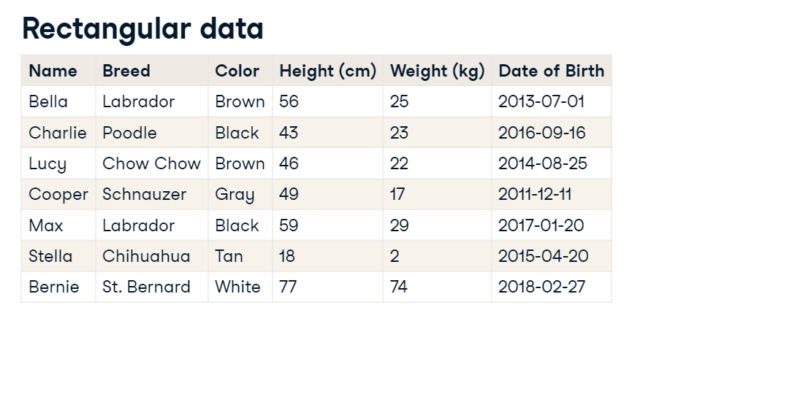
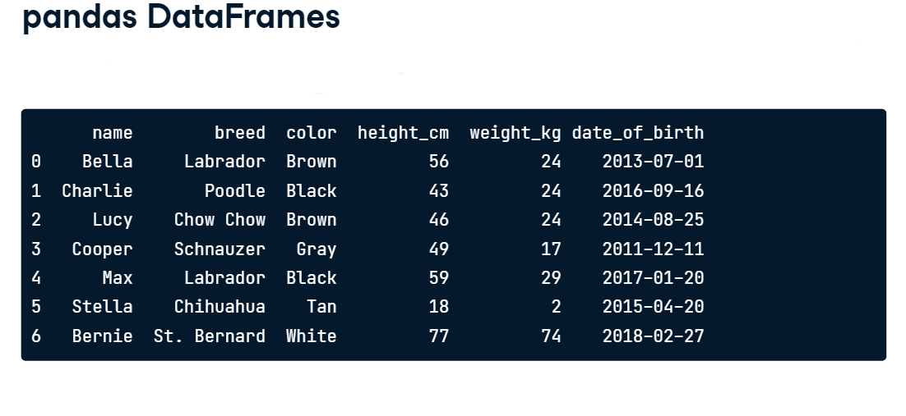
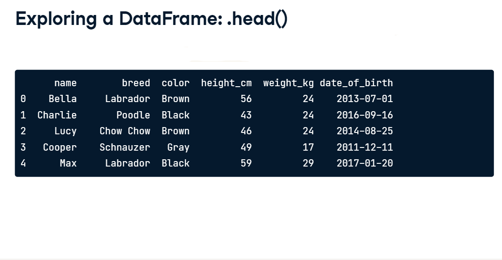
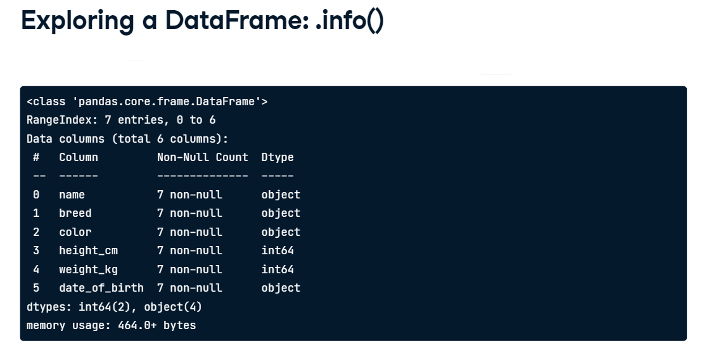

# Pandas
The Pandas library is a Python library that provides data structures and data analysis tools. Pandas is built on top of the NumPy library, which provides efficient storage and manipulation of dense data arrays in Python. Pandas provides additional functionality on top of NumPy, including labeled axes, time series functionality, and tools for loading data from disk, among other things. Pandas is a very powerful library, and we will only scratch the surface of what it can do in this course. [For more information](https://pandas.pydata.org/).
## To get more information 
 Get in touch with me and our community
 [Linkedin](https://www.linkedin.com/in/anwarrahim/)
 [Twitter](https://twitter.com/itsanwarrahim) 
 
## Rectangular Data

## Pandas DataFrame
A Pandas DataFrame is a 2-dimensional labeled data structure with columns of potentially different types. You can think of it like a spreadsheet or SQL table, or a dict of Series objects. It is generally the most commonly used pandas object. Like Series, DataFrame accepts many different kinds of input:
* Dict of 1D ndarrays, lists, dicts, or Series
* 2-D numpy.ndarray
* Structured or record ndarray
* A Series
* Another DataFrame
* Dict of Series
* Dict of dicts
* List of dicts or Series
* List of lists or tuples
* Another DataFrame
* NumPy MaskedArray

Along with the data, you can optionally pass index (row labels) and columns (column labels) arguments. If you pass an index and / or columns, you are guaranteeing the index and / or columns of the resulting DataFrame. Thus, this separates into three cases:
3a. No index or columns passed. The resulting index will be 0, ..., n - 1. The resulting columns will be 0, ..., n - 1.
3b. Index passed. The resulting columns will be 0, ..., n - 1.
3c. Columns passed. The resulting index will be 0, ..., n - 1.
3d. Index and columns passed. The resulting DataFrame will have exactly the index and columns passed.

## Creating a DataFrame

print(dogs)

dogs.head()

dogs.info( )

 